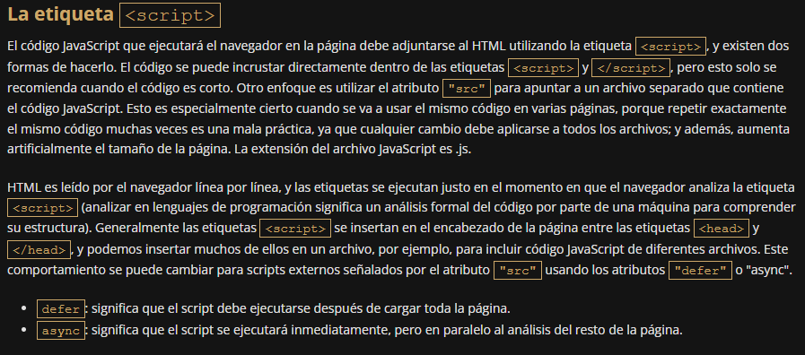

# CISCO Js 
## Módulo 1 

Entorno de desarrollo local
Como escribimos anteriormente, los requisitos de JavaScript para el entorno de desarrollo son muy modestos. 
En la mayoría de los casos, especialmente al comienzo del desarrollo, solo tres elementos son suficientes: un editor de 
código, un intérprete (es decir, un entorno de arranque) y un depurador.

Dependiendo del nivel de sofisticación, la complejidad del proyecto escrito o el entorno para el que escribimos nuestros 
programas (del lado del cliente, o del lado del servidor), es posible que también se necesiten otras herramientas.

Existirán, entre otras:

Administradores de paquetes: que permiten la gestión de librerías (que contienen soluciones listas para usar, que 
podemos emplear en nuestros programas) o componentes del entorno de desarrollo (por ejemplo: npm o yarn).

Ejecutores de tareas y empaquetadores de módulos: utilizados, en términos simples, para automatizar el proceso de 
desarrollo de software y unir el código resultante de muchos archivos y librerías (por ejemplo Grunt o Webpack).

Frameworks de pruebas: permiten realizar pruebas automáticas para la corrección de nuestro programa, al buscar posibles 
errores (por ejemplo Mocha, Jasmine, o Jest).

Analizadores de seguridad: como puede adivinar, se usan para controlar la seguridad de nuestra solución (por ejemplo, 
Snyk, RetireJS u OWASP Dependency Check).

## Editor de Código
El código de casi todos los lenguajes de programación se compone de alguna forma de texto. Entonces, para escribir el 
código, necesitamos un editor de texto. Pero debe ser una aplicación que escriba texto sin formato (no puede ser un 
editor de texto enriquecido, como MS Word). En otras palabras, solo un bloc de notas simple que pueda escribir archivos
.txt es suficiente para escribir código, aunque es mucho más fácil si se usa un editor de código dedicado. El mercado
está repleto de editores de código profesionales, tanto gratuitos como de paga. Algunos de ellos son universales, 
mientras que otros son exclusivos de lenguajes específicos. La principal ventaja de usar un editor de código dedicado 
es el resaltado de sintaxis, el autocompletado de texto y la verificación de errores. Esto mejora la eficiencia del 
trabajo y la comprensión del código, y reduce la cantidad de errores y errores tipográficos. Hay muchos buenos editores
de código, pero puede ser realmente difícil seleccionar uno que funcione bien para ti.

Aquí se mencionan algunos populares:
* Visual Studio Code
* WebStorm
* Sublime Text
* Notepad++

## Intérprete
Ya hemos hablado un poco sobre el intérprete y su función. Funciona como un entorno de ejecución para nuestro programa. 
Comprueba si hemos cometido algún error formal, por ejemplo, cometer un error tipográfico en el nombre de una función 
u olvidar cerrar un paréntesis, y luego ejecuta el programa instrucción por instrucción.

Como hemos dicho anteriormente, prácticamente todos los navegadores tienen motores (o intérpretes) JavaScript 
integrados, pero recomendamos encarecidamente usar Chrome de Google, o FireFox de Mozilla . Ambos son conocidos por su 
eficiencia y herramientas avanzadas integradas para desarrolladores web (ese eres tú). Están disponibles para Windows,
macOS y Linux.

## Depurador
Un depurador es una herramienta que te permite alentar o incluso detener la ejecución de un programa, ejecutar 
instrucciones paso a paso, ver y analizar el estado del programa en un momento dado.

**Dependiendo del navegador, allí encontraremos varias herramientas, pero seguramente habrá:**

* El inspector, que nos permitirá, por ejemplo, analizar los elementos HTML individuales de un sitio web abierto.

* La consola de JavaScript, que en primer lugar muestra toda la información sobre los errores y, en segundo lugar, nos 
permite ejecutar comandos de JavaScript únicos en el contexto de la página actual.

* El depurador, que entre otras cosas, muestra los valores actuales de las variables y te permite pausar la ejecución del 
código en el lugar indicado y ejecutarlo paso a paso (es decir, ejecutar instrucciones del programa).

## Módulo 2 

### Variables, Tipos de Datos, Conversión de Tipos de Datos y Comentarios

**Después de completar el Módulo 2, el estudiante:**

* Tendrá los conocimientos y las habilidades para trabajar con variables (es decir: nombrar, declarar, inicializar 
y modificar sus valores).
* Comprenderá conceptos como el alcance, los bloques de código, el sombreado y el hoising.
* Conocerá las propiedades básicas de los tipos de datos primitivos, como boolean, number, bigint, undefined, null, 
y será capaz de utilizarlos.
* Estará familiarizado con las propiedades básicas del tipo de dato primitivo string o cadena, incluidos los literales de 
cadena: comillas simples o dobles, el carácter de escape, la interpolación de cadenas, propiedades y métodos básicos.
* Conocerá las propiedades básicas de tipos de datos complejos como Array y Object (tratados como registros) y será capaz
de usarlos en la práctica.

.