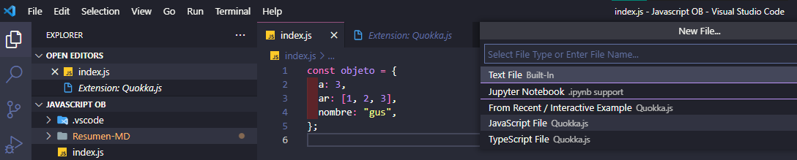
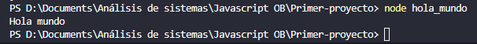
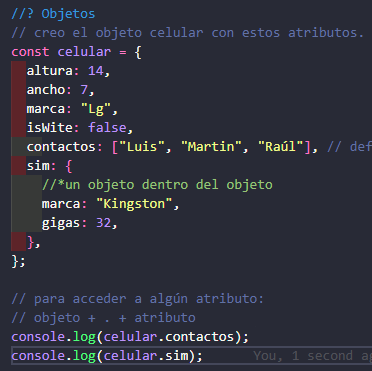
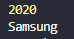
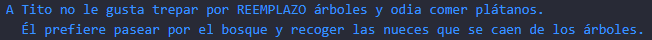
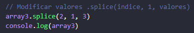
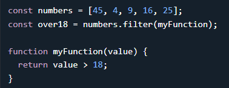

# JavaScript OB
## Clase 1. Introducción a JavaScript
### Intro al curso e instalación de plugins
En la primer clase hablo de la teoría que tipo de lenguaje es Js y recomendó plugins los cuales instalé.

De ellos Quokka es el único que no estaba usando.

Básicamente, va marcando en tiempo real los errores de código. 

Se debe abrir el archivo en Quokka para que funcione.

Luego de usarlo se guarda como un archivo `.Js` y lo transforma en un archivo normal.
### Node y NPM
Node.js es un entorno en tiempo de ejecución multiplataforma, de código abierto, para la capa del servidor (pero no 
limitándose a ello) basado en el lenguaje de programación JavaScript, asíncrono, con E/S de datos en una arquitectura 
orientada a eventos y basado en el motor V8 de Google. Fue creado con el enfoque de ser útil en la creación de programas 
de red altamente escalables, como por ejemplo, servidores web. Fue creado por Ryan Dahl en 2009 y su evolución está 
apadrinada por la empresa Joyent, que además tiene contratado a Dahl en plantilla.

Node.js es similar en su propósito a Twisted o Tornado de Python, Perl Object Environment de Perl, libevent o libev de
C, EventMachine de Ruby, vibe.d de D y Java EE de Java existe Apache MINA, Netty, Akka, Vert.x, Grizzly o Xsocket. 
Al contrario que la mayoría del código JavaScript, no se ejecuta en un navegador, sino en el servidor. Node.js 
implementa algunas especificaciones de CommonJS. Node.js incluye un entorno REPL para depuración interactiva.

https://es.wikipedia.org/wiki/Node.js

NPM es el sistema de gestión de paquetes por defecto para Node.js, un entorno de ejecución para JavaScript, bajo 
Artistic License 2.0.

Desde la versión 0.6.3 de Node.js npm es instalado automáticamente con el entorno. npm se ejecuta desde la línea de 
comandos y maneja las dependencias para una aplicación. Además, permite a los usuarios instalar aplicaciones Node.js 
que se encuentran en el repositorio. npm está escrito enteramente en JavaScript y fue desarrollado por Isaac Z. Schlueter
a raíz de la frustración que experimentó mientras trabajaba con CommonJS y considerando las deficiencias de otros 
proyectos similares como PHP (PEAR) y Perl (CPAN)

**_Luego vino la instalación, pero ya lo hice con el curso anterior._**

### Primer proyecto Node
Desde el CMD voy a crear una carpeta dentro de la ya creada para esta materia y subida a github.

 

* El comando `code .` abre el proyecto en VsCode.
* Con `ctrl shift ñ` abro la terminal.
* Con `npm init` creo el paquete `.json`

* Donde dice Package name es una pregunta, al poner hola-mundo le digo que ese es el nombre del paquete

* Description del proyecto

* El `entry point` lo dejo por defecto, va a ser el archivo por defecto a ejecutar.

* `Test command:` `jest` acá si quiero puedo usar una librería como jest para testear. por ahora queda vacío.
* `git repository:` lo dejo en blanco (aunque la carpeta si esta en git no subo particularmente ente .json) 
* `keywords: `hola-mundo no entendí muy bien por qué lo usó.
* `author:` Gustavo-MMB
* `license:` (ISC)  Lo dejo como está
**"puedo poner MIT como licencia sirve para varias cosas compartir, versionar y vender"** según platzi
******************************************
### Agregado del curso de platzi de asincronismo:
1. pwd: Saber donde estoy ubicado.
2. mkdir: Creación de carpeta
3. cd: Moverse a carpetas
4. git init: Inicias Git ***///// creo antes el repo que el json***
5. npm init: Le da nombre, versión, entre otras cosas al proyecto
6. code . : Inicia el editor de códigos
7. creo el .gitignore  ***///// simple lo crea y abre para agregar los*** `/node_modules/`
******************************************

Luego de aceptar con enter me genera el `.json`

 

   

Acá puedo modificar los datos que ingresé
* Creo los archivos **`inex.js`** y `holamundo.js`

Una de las formas de ejecutarlo es a través de node, en la terminal escribo: `node + nombre de archivo`

   

#### Esta prueba la hice el dia posterior y antes de cursar lo de UTN

### Ejecución y comentarios

**Scripts == guiones** Son código que se va a ejecutar 

Desde la terminal podemos ejecutar los scripts del archivo `package.json` por ejemplo con la sentencia:` npm run + monbre del script` 
en este caso de ejemplo solo hay un script que es "test".

 

Lo que vemos es que a través de la terminal nos mostró lo que hay en test, si fuera un script más complejo del mismo 
modo sería ejecutado.

Como ejemplo aunque esto no se usa, inicio desde la terminal node `package.json` al archivo `hola_mundo`. 
Hice que el paquete lo abra.

  

* Lo habitual sería ir al index del proyecto donde estaría el programa.
* Importantísimo anteponer `node` antes del nombre de archivo .js.

 

### primer tarea 
La carpeta la cree en windows y deje más espacios en blanco en él `npm init`, luego seguí todos los pasos de esta guía.

1. A continuación cree el `index.js` y pegué la frase de saludo de OB.
2. Cree el script start en el paquete `.json` 

3. Ejecute el script. con el comando: `npm start`.

## Clase 2 Sintaxis variables y palabras reservadas de JS
### Tipado en JS y tipos primitivos
https://www.w3schools.com/js/js_typeof.asp

**Tipado inferido** la variable será definida al momento de ser interpretada. Entre sus **ventajas** está la velocidad para 
escribir el código y entre las **desventajas** que el ide no nos va a dar error si cambiamos por ejemplo un string a int, 
puede ocasionar problemas.

Los tipos en Js tienen 2 grandes grupos: primitivos y objetos.

**_Primitivos:_** 
1. Número (con o sin decimal, no hay float en JS)
2. String
3. Booleano
4. Nulo (crea una variable con un espacio vacío en memoria)
5. Indefinido

**_Objetos:_**

### Declaración de variables y escritura dinámica
4 Ways to Declare a JavaScript Variable:
* Using var
* Using let
* Using const
* Using nothing

**When to Use JavaScript var?**

Always declare JavaScript variables with var,let, or const.

The var keyword is used in all JavaScript code from 1995 to 2015.

The let and const keywords were added to JavaScript in 2015.

If you want your code to run in older browsers, you must use var.

**When to Use JavaScript const?**

If you want a general rule: always declare variables with const.

If you think the value of the variable can change, use let.

**JavaScript Identifiers**

All JavaScript variables must be identified with unique names.

These unique names are called identifiers.

Identifiers can be short names (like x and y) or more descriptive names (age, sum, totalVolume).

The general rules for constructing names for variables (unique identifiers) are:

* Names can contain letters, digits, underscores, and dollar signs.
* Names must begin with a letter.
* Names can also begin with $ and _ (but we will not use it in this tutorial).
* Names are case-sensitive (y and Y are different variables).
* Reserved words (like JavaScript keywords) cannot be used as names.

Si afecto una variable declarada con var dentro de una función por ejemplo esta cambia de manera global. 

Si afecto una variable declarada con let dentro de una función esta solo cambia dentro de la misma.

### Notación en JavaScript
Detalles en el código.

### Listas, Objetos y Fechas en JS
#### Listas
Las listas se declaran de 2 maneras detalles en el código.

En el caso lista3 al poner 4 me crea una lista vacía con 4 posiciones.

 Agrego valores dentro del array 

#### Importante no podía abrir la carpeta con espacio porque eran necesarias las comillas

*///

Me costó mucho hacer correr el script en la terminal, con _**npm** no pude_ luego de agregarlo correctamente a la carpeta 
Clase 1 y al `.Json` ahora lo voy a correr de carpeta para probar si funciona en Clase 2 que es donde debe ir.
* Lo cambié de carpeta y funcionó 
* Sin estar agregado al archivo `Package.json` funciona igual
* Por último si estoy fuera de la carpeta del archivo asi sea la carpeta superior NO funciona.

#### Objetos
https://www.w3schools.com/js/js_objects.asp HAY UNA BUENA EXPLICACIÓN DE THIS

In real life, a car is an object.

A car has properties like weight and color, and methods like start and stop:

   

* All cars have the same properties, but the property values differ from car to car.

* All cars have the same methods, but the methods are performed at different times.

* Objects are variables too. But objects can contain many values.

* This code assigns many values (Fiat, 500, white) to a variable named car:
`const car = {type:"Fiat", model:"500", color:"white"};`

Object Definition

You define (and create) a JavaScript object with an object literal: const person = 
`{firstName:"John", lastName:"Doe", age:50, eyeColor:"blue"};`

Spaces and line breaks are not important. An object definition can span multiple lines: 

**Accessing Object Properties**

You can access object properties in two ways:

* `objectName.propertyName`
* `objectName["propertyName"]`

**Object Methods**

Objects can also have methods.

Methods are actions that can be performed on objects.

Methods are stored in properties as function definitions.

   

   

In the example above, `this` refers to the person object.
(I.E.== O SEA) `this.firstName` means the _firstName_ property of _this._
I.E.` this.firstName` means the _firstName_ property of _person_.

 **Accessing Object Methods**   
 
You access an object method with the following syntax: `objectName.methodName()` ejemplo `name = person.fullName();`

Si olvidamos los paréntesis devuelve la definición de la función "la fórmula"

**En el ejemplo de la clase creamos un objeto con distintos tipos de atributos, string, arrays, objeto dentro de objeto.
Luego accedí al array y al obj. dentro del obj.**

 

Agrego un atributo desde fuera y modifico otro.

 

#### Fechas
Según el profesor son difíciles de trabajar conviene usar librerías como: Momento.js

https://www.w3schools.com/js/js_dates.asp

JavaScript Date Output

By default, JavaScript will use the browser's time zone and display a date as a full text string:

**Mon Oct 17 2022 11:32:36 GMT-0300 (hora estándar de Argentina)**

Los números

Clase 

**Extra**

_"\n" Salto de linea en string_ 

_**para imprimir prolijo en menos líneas de código.**_

## Clase 3 Estructuras de control
### Bifurcaciones if else y switch
En esta clase copié al profesor y abrí el archivo en quokka con `ctrl p `y escribí en la barra un: `>` luego seleccioné 
Quokka new javaScript file.

Sin apuntes porque esta todo en el código.

### Comparaciones en JS
En esta clase explica el `==` y el `===` también los `!=` y `!==`.

casos: distinto valor, distinto tipo y distintos valores y tipo. el`!==`se va a activar en los dos casos juntos o 
separados y `!=` solo si son de distinto valor.

### Bucles for y while
#### For // for in // for of // wile // do-wile
https://www.w3schools.com/js/js_loop_for.asp

Mucho para ver!!!

`for` `(inicialización, condición, actualización)` `{`comienza con el valor `i`, un ejemplo de condición puede ser
mientras `i` sea menor que 10, entonces al final de cada iteración a "`i`" le suma 1`}`

 
Los bucles son ideales para recorrer listas/arrays.

#### Estructura forEach

Esta es una función flecha, tomé la variable valor e iteré dentro de ella, es también una callback function,
ejecuta una función al terminar otra en el orden que le de yo y no en el que se crearon.

“Los `callbacks` aseguran que una función no se va a ejecutar antes de que se complete una tarea, sino que se ejecutará
justo después de que la tarea se haya completado. Nos ayuda a desarrollar código JavaScript asíncrono y nos mantiene a
salvo de problemas y errores.”

Para eso son los callbacks, para que una function no se ejecute hasta que antes se ejecute otra que necesitamos.

#### For in

Respecto a `wile` y `do wile` lo más importante es que si me equivoco se puede ejecutar infinitamente y que do wile
ejecuta si o si el código al menos una vez.

#### Formas de controlar los bucles con continue y break

En la clase usando Quokka se ve el ámbito de las variables y explica el uso de break y continue.
Casos muy específicos - break, continue .. Recomienda no usarlo por ser una mala práctica
con var las variables son globales con let quedan dentro del bucle.

#### Etiquetas en los bucles
Labels nos permiten nombrar los bucles for o while. --- nos pueden ayudar en caso de querer usar break y continue a 
controlarlos mejor.

Tampoco es una forma correcta de hacerlo pero ese modo de ejemplo

la etiqueta es con esa sintaxis "bucleDecenas: " antes del while 

#### Ejercicio 3 Factoriales
https://factorial.mx/numero-funcion-factorial

Me costó bastante la logica luego el manejo de los bucles con los ejemplos de clase salió bien

## Clase 4 Strings
### Tipos de declaración de strings y cuando utilizarlos

Alterna entre comillas simples y dobles como en python. Se suman las comillas hacia atrás `` o *backticks* estas 
últimas tiene otra función que es la de **introducir variables dentro de la string** y *permite el salto de línea también*. 
Se va a usar mucho en vue, react etc.

### Métodos más comunes de los strings

`console.log(str.length);` Da la cantidad de caracteres

Obtener partes de cadenas de caracteres

`slice() substring() substr()` substr está quedando obsoleto. (deprecated)

`let slice_str = str.slice(5, 10);`

`console.log(slice_str);`

Reemplazar parte del contenido de una cadena de texto

`cadena.replace("Gorka", "Miguel")` Al utilizar strings sólo reemplaza la primera instancia

  

Al utilizar la expresión regular `/g (global)`, reemplaza todas las instancias

`texto_largo.replace(/los/g, "REEMPLAZO")` **Mucha atención a la sintaxis!!**

  

### Manipulación de cadenas de texto

Ejemplos en el código, se vio. 
* to lower 
* to upper
* comparar entre ambos
* concatenar, 3 formas distintas una en particular no conviene en Js porque puede sumar números
* trim para eliminar espacios en total, al principio y al final
* obtener la posición de un character
* la posición de una palabra, su primera aparición y la última.

### Expresiones regulares y métodos de búsqueda de cadenas

https://regexr.com       para practicar uso de las expresiones regulares

Salvo que lo indique va ser siempre case sensitive

* buscar las apariciones de una palabra o frase (ojo que es como en pdf encuentra coincidencias dentro de palabras también)
* saber si existe palabra o frase dentro de un texto
* saber si empieza o termina con...

## Clase 5 Números en JavaScript
### Numbers y precisión en JS
**Todos los números se declaran igual no hay int o float.**
* Javascript no está hecho para ser preciso por ejemplo (0.1 + 0.3) da 0.30000000000004 lo cual es impreciso y tiene 
que ver con como almacena los bits en memoria.
* Hay varias maneras y librerías para redondear de manera mas exacta. por ejemplo
`console.log(Math.round((0.1 + 0.2) * 100)/100);`

En esta sesión usé Quokka para practicar. Es muy sencilla asi que solo agrego captura.

### Operaciones y redondeo
Algo para trabajar con números que puede ser útil es el método `var + .toString()` ejemplo.

#### Método `toFixed()`
El método `.toFixed()` reduce la cantidad de decimales a los que yo quiera, pero lo convierte en string. 

También puede sumar decimales a un número.

#### Método `toPrecision()`
Este método nos da la cantidad de cifras significativas teniendo en cuenta los enteros y decimales, el concepto 
matemático de cifras significativas no lo Sé. También devuelve una String.

Algo muy **importante** del ejemplo que no explicó es porque a un número entero de muchas cifras lo transforma en un 
decimal de muchas cifras es decir corrió la coma muchas posiciones.

#### Método `Math.Ceil()` y `Math.floor()`

### Métodos de numbers y límites en JS
Otra manera de declarar números es `casteando` la variable `b` es un prototipo con valor 3 que es lo que demuestra 
el método `.valueOf`, internamente Js opera con los valores.

Si utilizo el `casteo` con strings los devuelve como iterables ¡No es muy usado!

#### NaN == not a number
Es el error que arroja cuando intento usar como número algo que no lo es.

Tiene un método que es `.isNaN()`

#### Infinito

#### Convertir tipos `parseInt y parseFloat`

Un caso probable en Js es que al querer sumar 2 valores, pero que en realidad son una string y un número NO nos arroje 
error y en su lugar nos de un resultado que no es matemático. En el ejemplo toma a los dos como string y los concatena.

Operador `Number()` nos permite hacer un parse siempre y cuando la string esté compuesta por números y no por letras.

#### Parse 
* parseInt redondea y convierte en entero
* parseFloat lo toma como es en caso de ser decimal

#### Hexadecimales (base 16)
Los hexadecimales son enteros siempre no existen los float en hexadecimal.

Para convertirlos simplemente usamos `parseInt` .

 _Muy importante expresar la base en este caso (16)_ 

#### Valores máximo y mínimo en Javascript
Los 3 ejemplos a continuación NO son métodos son propiedades. Los explica a modo de curiosidad.

Epsilon es el mínimo valor de diferencia entre do números equivale aproximadamente a `0.000000000022...`.

#### Ejercicio 

https://www.w3schools.com/js/tryit.asp?filename=tryjs_number_tofixed

https://www.delftstack.com/es/howto/javascript/javascript-round-to-2-decimal-places/
En este último utilizo `Math.round()`

## Clase 6 Trabajando con listas === Arrays
¡In 2015, JavaScript introduced an important new keyword: `const.` It has become a common practice to declare arrays 
using `const:`.
* An array declared with const cannot be reassigned
* Arrays are Not Constants
* The keyword const is a little misleading.
It does NOT define a constant array. It defines a constant reference to an array.
Because of this, we can still change the elements of a constant array.

### Métodos básicos
* Las listas arrays en Js pueden tener todo tipo de valor en una misma lista.
* Se accede como en los demás lenguajes por posición en base 0. (Índice)

#### Introducir valores
* Al final con `.push()`
* Al principio con `.unshift()`

#### Eliminar valores
* Al final con `.pop()`
* Al principio con `.shift()`

 

#### Eliminar, modificar o añadir valores
* `.splice(x, y, z)`

El intelisense nos va a orientar en su uso: 

* El primer valor es el índice de donde parten los cambios
* El según es la cantidad de cambios a partir de ahí
* Si hay un tercer valor será lo que se agregue

Eliminar: **A partir del índice 2 borra ún valor**

 

Añadir: **Similar al anterior salvo que el 0 como segundo parámetro dice que no borra nada y el 3er parámetro 
suma un nuevo valor**

 

Modificar: **En el índice 2 va a sumar un valor, el 3er parámetro que en este caso es el `3`.**

 

----------------------------------------------------
#### Concatenación-listas-y-factor-de-propagación.js 
Una de las maneras de concatenar es a través del método `.concat()` este No modifica los valores de las listas.

 

Otra manera es creando una nueva lista: 

 

Factor de propagación más utilizado por el profesor:

Con la sintaxis `console.log(...lista3)` nos da los valores por separado y no dentro de una lista

 

Por último un error común es crear una array de listas sin concatenar lo que da:
un array con mas arrays dentro.

 

----------------------------------------------------------------------------------------

#### Cómo obtener una lista a partir de otra `.slice()`
**_No es lo mismo que `splice`_**

* ESTE MÉTODO NO MODIFICA EL VALOR DEL ARRAY ORIGINAL
* `array.slice(1, 4)` nos da inicio y fin según indice , no toma al último
* `const array2 = array.slice(2, 5)` // Acá construyo otro array
* `const array3 = array.slice(2, -2)` En este caso el número negativo cuenta del final hacia el comienzo la cantidad de
pociones empezando de 1 o sea -2 va a contar 2 posiciones hacia atrás.

-----------------------------------------------
#### Iterar los valores de una lista

Ecma 6 tiene una manera mejor para iterar listas que la conocida bucle for

Forma nueva ES6 (más eficiente) `.forEach()`

Búsqueda de un valor dentro de una lista `.find()`

 Poco eficiente...

Maneras sintácticas de buscar la propiedad de un objeto dentro de una lista de objetos con función flecha.

* Manera más sintáctica si "o" es igual a Miguel devuelve true y puedo seguir operando
* ya almacenado el obj Miguel pregunto la edad arroja `28`

Otra forma: 

* acá toma {edad} entre {} porque sabemos que es parte de un objeto
* accede a la propiedad edad del objeto que esta devolviendo el método `.find`

----------------------------------------

#### Métodos avanzados, obtención de listas a partir de listas [Map, filter y reduce son muy utilizados en react angular etc.]
Comienza mostrando una función `.forEach()` donde esta solo se usa para iterar sin arrojar otro dato o resultado. 
Ejemplo en el código

https://www.w3schools.com/js/js_array_iteration.asp

#### Función `map()`

* The `map()` method creates a new array by performing a function on each array element.
* The `map()` method does not execute the function for array elements without values.
* The `map()` method does not change the original array.

En el ejemplo va a agregar a cada valor un número antes, de manera incremental en cada iteración.
* Esta función tiene 2 parámetros (valor , índice)
* En el ejemplo de manera optimizada se ordena que sume 1 en el índice en cada iteración.
* Para expresarlo se concatena y reordena. 

#### Función `filter()`
**The filter() method creates a new array with array elements that pass a test.**

¡IMPORTANTE! Para entender bien la función automáticamente recibe 3 parámetros, pero es algo interno de ella no 
es necesario darlos. En estos 2 ejemplos con 3 o 1 parámetro funciona bien.

 

En este caso comienza mostrando el método viejo similar a python y otros. 
* Función filter va a retornar true, quiere decir que la primera condición va a ser True si o si. 
* en el ejemplo 2 **niega** al objeto Miguel para que todo lo demás sea cierto y lo muestre.

La manera óptima es la siguiente:

Acá filtra a miguel y muestra a todos los demás

#### Función `reduce()`

* The `reduce()` method runs a function on each array element to produce `(reduce it to)` a single value.
* The `reduce()` method works from left-to-right in the array. See also `reduceRight()`.

This example finds the sum of all numbers in an array:

Note that the function takes 4 arguments: _"obligatorios son 2 pero acepta 4"_

* The total (the initial value / previously returned value)
* The item value
* The item index
* The array itself
* The example above does not use the index and array parameters. It can be rewritten to:

The reduce() method can accept an initial value: 

`const numbers = [45, 4, 9, 16, 25];`

`let sum = numbers.reduce(myFunction, 100);`

`function myFunction(total, value) {`

 ` return total + value;`

`}` Va a dar como resultado la suma a partir de 100

Este ejemplo muy exagerado es para ver como se van modificando los distintos argumentos en cada iteración:

El valor inicial Comienza con el valor del índice 0 y en esta variable se van a acumular los valores en cada vuelta.

--------------------------------------------

#### Ordenación de listas y comparación entre dos listas
Método `.sort()`
* Este método modifica el array al ordenarlo
* The `sort()` method sorts an array alphabetically
* The `reverse()` method reverses the elements in an array.

##### Numeric Sort
* By default, the `sort()` function sorts values as strings.
* **Es obligatorio que retorne un valor**

* This works well for strings `("Apple" comes before "Banana")`.

* However, if numbers are sorted as strings, `"25"` is bigger than `"100"`, because `"2"` is bigger than` "1"`.

* Because of this, the` sort()` method will produce incorrect result when sorting numbers.
* _Para solucionar este problema usamos una función callback que ordene a los números tomándolos como string_

Manera n.º 1 menos sintáctica pero la misma lógica:

* Esta **_callback function_** siempre va a comparar de a 2 valores y según se lo pida los va a ordenar luego pasa al 
siguiente par iterando el array.
* No importa si es -1 o -6565644465645 lo importante es que valga menos que el otro valor y viceversa.

Manera nº2 mas sintáctica

When the sort() function compares two values, it sends the values to the compare function, and sorts the values 
according to the returned (negative, zero, positive) value.

* If the result is negative, a is sorted before b.
* If the result is positive, b is sorted before a.
* If the result is 0, no changes are done with the sort order of the two values.

Example:

The compare function compares all the values in the array, two values at a time `(a, b)`.
When comparing 40 and 100, the `sort()` method calls the compare function(40, 100).
The function calculates `40 - 100 (a - b)`, and since the result is negative `(-60)`, the sort function will sort` 40` 
as a value lower than`100`.

De la misma manera que en el ejemplo anterior el método `.sort()` va a ordenar listas de objetos comparando el mismo 
valor de cada objeto. 

Orden por edad: 

### Comparación entre dos listas _parte 2 del video_
#### Primero vemos el método `.every()` en una sola lista.

El método `.every()` va a chequear si todos los valores del array pasan una condición.

Puede tomar 3 argumentos: (value, index, array) pero con aportar el valor alcanza.

Esta función callback me retorna true si el tipo de todos los valores es num, esto almacenado en la variable "valor".

Un ejemplo similar es comparando si son mayores a 0 

MANERA MÁS SINTÁCTICA

#### Ahora ya conociendo `.every()` vemos como comparar.

Importante!!! 

Para empezar py para ahorrar trabajo del cpu y memoria voy a comparar si las listas tienen el mismo largo para después
hacer un trabajo más pesado. Si no son iguales va a salir de la Función.

Luego en la misma función: ---  De esta manera compara el valor en el mismo índice de cada array. 

 

### Identificar si existe un valor en un array y objetos iterables

`.some()` significa alguno, a diferencia del every en el que todos deben cumplir una condición con some alcanza con que 
la cumplan algunos.

Con esta sintaxis pregunto si existe un determinado elemento en el objeto.

#### Ejercicio 6 finalizado

## Clase 7 Trabajando con Sets y Objetos

### Trabajando con Sets (conjuntos)

Una de las características de los sets es que no nos permiten almacenar valores repetidos, si agregamos valores iguales 
solo guarda el primero. (en caso de variables, no de objetos porque estos últimos tienen diferente espacio en memoria)

https://www.w3schools.com/js/js_sets.asp Aquí explica los métodos

Con el factor de propagación `[...]` convierto un set en array y con esto me aseguro de que el mismo no tiene valores 
repetidos.

### Trabajando con objetos (se usan mucho en react)

En este objeto trabaja de 2 maneras distintas:

1. key: + Valor entre "comillas" 
2. key entre"comillas": + valor como un array  

Ambos se pueden combinar en el mismo objeto

### Fechas en JavaScript

Código en el archivo fecha.js muy sencillo.

### ejercicios:

1. En mi resolución creé un array y lo transformé en set, el Ob directamente declaran todo junto.

2. En mi resolución iba bien hasta que usé un objeto dentro de la lista de objetos, la solución era usar el 
factor de propagación ***dentro del objeto***

3. 

.
