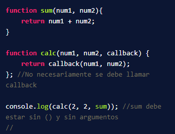
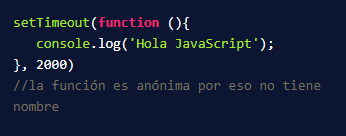
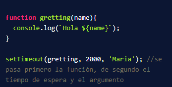

# Asincronismo Platzi
******************************************
### Agregado del curso de platzi de asincronismo:
1. pwd: Saber donde estoy ubicado.
2. mkdir: Creación de carpeta
3. cd: Moverse a carpetas
4. git init: Inicias Git ***///// creo antes el repo que el json***
5. npm init: Le da nombre, versión, entre otras cosas al proyecto
6. code . : Inicia el editor de códigos
7. creo el .gitignore  ***///// simple lo crea y abre para agregar los*** `/node_modules/`
******************************************
### 𝗖𝗹𝗮𝘀𝗲 #𝟲: 𝗤𝘂é 𝘀𝗼𝗻 𝗹𝗼𝘀 𝗖𝗮𝗹𝗹𝗯𝗮𝗰𝗸𝘀 
Un Callback es una una función que se pasa como argumento de otra función y que será invocada.

✏️ Ejemplos:

* En VSC crear una carpeta dentro de la carpeta src llamada `callback`
* Crear dentro de la carpeta callback el archivo `index.js`
* Dentro de `index.js` se coloca la estructura de los que será un `callback`:

* Luego se selecciona el código y al dar click derecho, seleccionar `Run Code` (debe estar instalado la extensión Code Runner).
* Aparece abajo la consola con la salida de la suma de los 2 números.
* Para el segundo ejemplo, se tiene un `setTimeout` que funciona como un `callback`, en el código está configurado para 
imprimir el mensaje 2 segundos después de ejecutar el código con Run Code:

* En el tercer ejemplo tenemos un setTimeout con una función que se le pasa por argumento:

### 𝗖𝗹𝗮𝘀𝗲 #𝟳: 𝗫𝗠𝗟𝗛𝗧𝗧𝗣𝗥𝗲𝗾𝘂𝗲𝘀𝘁𝟳/𝟮𝟭 📤

📲 XMLHttpRequest es un objeto de JS que permite hacer peticiones hacia servicios en la nube(URLs o APIs).

📪 Existen 5 estados en un llamado XMLHttpRequest:

* 0 → Se ha inicializado.
* 1 → Loading (cargando).
* 2 → Se ha cargado.
* 3 → Procesamiento si existe alguna descarga.
* 4 → Completado.

#### Métodos y propiedades:
`xmlhttp.open()` → Prepara la petición para ser enviada tomando tres parámetros: prótocolo, url, asíncrono (true).

`xmlhttp.readyState` → Retorna el estado de la petición.

`xmlhttp.onreadystatechange` → Un eventHandler que es llamado cuando la propiedad readyState cambia.

`xmlhttp.status` → Retorna el estado de la respuesta de la petición. (200,400,500)

`xmlhttp.send()` → Envía la petición.

#### Características del protocolo http:
**Verbos:** Los verbos indican acciones que están asociadas a peticiones y recursos, es decir, sirven para la manipulación
de recursos cliente/servidor. 

Los Verbos http son:
* **GET** → Solicita un recurso.
* **HEAD** → Solicita un recurso pero sin retornar información, la estructura de esta petición es igual que get tanto en su 
headers como estatus. Es útil cuando vamos a utilizar API, para comprobar si lo que vamos a enviar está correcto y 
puede ser procesado.
* **POST** → Sirve para la creación de recursos en el servidor.
* **PUT** → Actualiza por completo un recurso, reemplaza todas las representaciones actuales del recurso de destino con la 
carga útil de la petición.
* **PATCH** → Actualiza parcialmente un recurso.
* **DELETE** → Elimina un recurso.

#### Los códigos de estados del servidor:
El código de estado (status codes) sirve para describir el estado de la petición hecha al servidor.
* 1xx → Indican que la petición fue recibida por el servidor, pero está siendo procesada por el servidor.
* 2xx → Indican que la petición fue recibida, aceptada y procesada correctamente.
* 3xx → Indican que hay que tomar acciones adicionales para completar la solicitud.
* 4xx → Indican errores del lado del cliente que hizo mal una solicitud.
* 5xx → Indican errores del servidor. Suelen aparecer cuando existe un fallo en la ejecución en el servidor.

